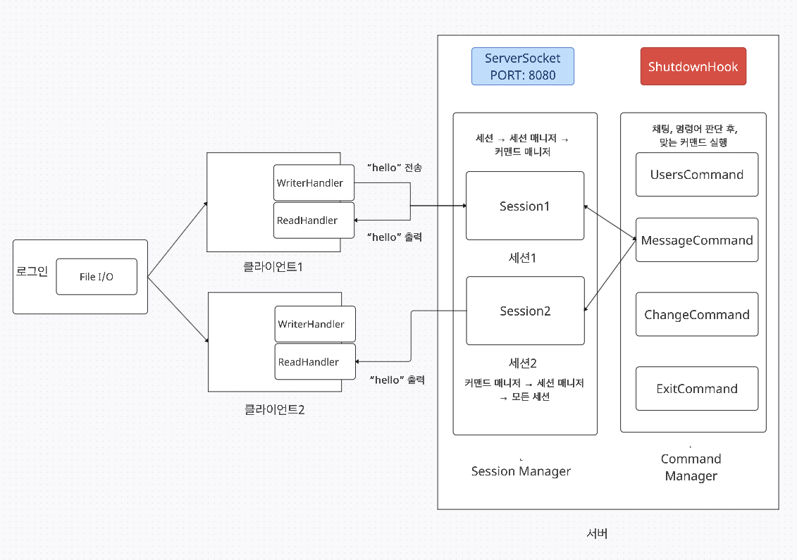
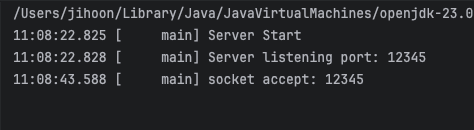
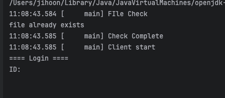
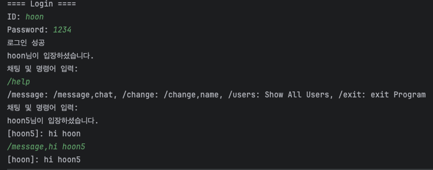
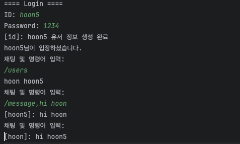

# [커널아카데미] 백엔드 개발 부트캠프 - 3주차 회고

## | 지난 한 주를 되돌아 보면서

 

지난 한 주 동안, 실시간 채팅 프로그램 클론 코딩에 기능 및 고려해야 할 점을 추가하여
개발하였고, 스프링 공부를 시작하였다. 실시간 채팅 프로그램에 File Reader/Writer를 통해
회원 정보를 저장하여, 다음 프로그램 실행에도 저장되어 있는 회원 정보로 로그인을 할 수 있는 기능을
추가했다. 그리고 고려해야할 점으로 회원저장에 경합조건이 발생할 수 있다는 점을 고려해서 동기화 설정을 고려하였다.

### | 스터디 요약 ###

다음과 같은 설계도를 통해 실시간 채팅 프로그램을 클론 코딩 하였으며, 설계도 제작은
https://app.creately.com/ 에서 설계하였으며, 실행 결과는 다음과 같다.

 

  
클라이언트와 서버를 연결, 회원정보 저장 파일 확인.
  

 

  
ID식별을 통해 로그인과 회원가입을 구분하고, /help 명령어를 통해 명령어를 알 수 있다.
help 명령어에서 나온 것처럼 /message,chat을 통해 채팅창에 메시지를 입력할 수 있다.
  

## | 앞으로 목표

 
남궁성 강사님께서 이펙티브 자바 및 디자인 패턴 책을 추천해주셨다. 다음주부터는
두 가지 책 중 한 가지 책과 스프링을 공부할 예정이다.